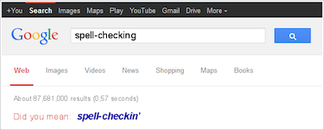

## Spell Checking

Quando gli utenti specificano una query possono commettere degli errori. Errori che portano un motore di ricerca a restituire della risposte vuote. Per prevenire questo problema i motori di ricerca utilizzano delle tecniche dette di spell-checking. Queste tecniche prevedono che a fronte di una ricerca errata vengano prodotti dei suggerimenti che l'utente può utilizzare per correggere la query.

### Distanza di edit

Un primo aspetto di cui si tiene conto nella costruzione dei suggerimenti è quello della similarità lessicale, misurata utilizzando l'edit distance. La metrica più nota per il calcolo della edit distance è la Levenshtein distance. La Levenshtein distance tra la sequenza di caratteri $x$ e la sequenza di caratteri $y$ è definita come il minimo numero di modifiche* (inserimenti, cancellazioni e sostituzioni) che devono essere applicate alla sequenza di caratteri $x$ per trasformarla nella sequenza di caratteri $y$.

\* modifiche single-character, modiche che coinvolgono un solo carattere alla volta.

Essendo l'efficienza uno degli aspetti fondamentali per un motore di ricerca, non si può pensare di calcolare la distanza di edit tra il termine di cui si vuole individuare la correzione e l'intero dizionario. È necessario restringere l'insieme dei termini rispetto ai quali si vuole calcolare la similarità lessicale. Questo insieme viene ridotto andando a considerare solamente le parole che:

- hanno una lunghezza simile a quella del termine errato;
- hanno gli stessi caratteri iniziali.

### Soundex code

Il Soundex code è un codice che raggruppa (clusterizza) parole sulla base della loro similarità fonetica.

```
Mantieni la prima lettera della parola in caratteri maiuscoli;

Sostituisci tutte le occorrenze delle lettere in {a, e, i, o, u, y, h , w} con il simbolo '-';

Rimpiazza le altre lettere utilizzando dei numeri nel seguente modo:
    1: b, f, p, v
    2: c, g, j, k, q, s, x, z
    3: d, t
    4: l
    5: m, n
    6: r

Nel caso in cui lo stesso carattere compaia in due posizioni consecutive, elimina una delle due occorrenze;

Elimina tutte le occorrenze del simbolo '-';

Mantieni i primi tre numeri, nel caso in cui non ci siano tre numeri effettua il padding utilizzando il carattere '0';
```

Il Soundex code consente quindi di effettuare un ulteriore restrizione dell'insieme delle potenziali correzioni, consentendo di andare a considerare solamente le parole simili dal punto di vista del suono.

### Ordinamento

La funzionalità di spell-checking viene spesso implementata dai motori di ricerca presentando a fronte di una ricerca errata, un messaggio del tipo 'Did you mean: ...'.

<div style="text-align:center">
	
</div>

Per poter implementare questa funzionalità è necessario che il processo di spell-checking produca un ordinamento dei potenziali suggerimenti. Il modo in cui i motori di ricerca implementano questa funzionalità è utilizzando un approccio probabilistico:

1. definisci un sottoinsieme $C$ del dizionario contenente le potenziali correzioni utilizzando uno dei metodi precedenti;
2. calcola la probabilità che il termine $c_i \in C$ sia il termine che la giusta correzione.

#### Noisy Channel Model

Il Noisy Channel Model utilizza un approccio probabilistico e stima la probabilità, che data una parola $e$, la parola intesa sia la parola $w$ come:

\\\[
  P(w|e) = P(e|w) * P(w)
\\\]

dove $P(w)$ rappresenta la probabilità con cui l'utente utilizzare la parola $w$, ottenuta a partire dal language model dell'utente, e P(e|w) rappresenta la probabilità con cui l'utente vuole inserire la parola $w$ ma sbaglia inserisce invece la parola $e$, ossia il modello dell'errore.

Questo ha senso se si pensa che uno specifico errore di battitura, ossia la sostituzione per errore della parola $w$ con la parola $e$, sarà tanto più probabile quanto più una parola è frequente la parola $w$ e tanto più sarà probabile che data la parola $w$ si sbagli e si scriva la parola $e$.

Queste probabilità possono essere estratte dai query log degli utenti, in particolare, si può andare a valutare facilmente la probabilità a priori $P(w)$ andando a stimare contare le occorrenze del termine $w$ nel query log. Il discorso è leggermente diverso per quanto riguarda la condizionata $P(e|w)$, questo perché questa probabilità è fortemente legata ad aspetti come la tastiera utilizzata dall'utente che ha commesso l'errore, un'aspetto che cambia da paese a paese ma che comunque può essere stimato con relativa facilità. Nel caso in cui non si voglia effettuare un'analisi più semplice e si sia disponibili ad accontentarsi di una stima rozza, si può assegnare il valore di probabilità $P(e|w)$ in base alla distanza di edit tra $e$ e $w$; questo ovviamente vorrà dire che moltissime potenziali correzioni avranno la medesima probabilità $P(e|w)$*.

\* Tutte quelle a distanza 1 avranno la stessa probabilità, tutte quella a distanza 2 avranno la stessa probabilità, ...

Un'altro aspetto di cui si può tenere conto durante il calcolo della probabilità è quello del contesto in cui si è verificato l'errore. È importante non confondere i diversi usi del termine *contesto*. In ambito linguistico, il contesto di una parola è rappresentato dall'insieme delle parole che la circondano (precedono/seguono). Nel caso dello spell-checking si analizza una finestra di contesto rappresentata da unigrammi, ossia si utilizza solamente la parola che precede l'errore per stimare la probabilità che un suggerimento sia quello corretto. Si potrebbero anche considerare finestre più ampie rispetto agli unigrammi, ma tipicamente non si considerano finestre più lunghe di due. Questo perché la lunghezza media di una query è compresa tra 2/3 parole.

Considerando il contesto è quindi possibile ridefinire la probabilità $P(w)$ utilizzata in precedenza come:

\\\[
  P(w) = \lambda * P(w) + (1 - \lambda) * P(w|w_p)
\\\]

Questo vuol dire che la probabilità che la parola di una parola è data dalla combinazione lineare della probabilità dell'utilizzo della parola $w$ da sola e la probabilità che la parola $W$ sia stata digitata immediatamente dopo la parola $w_p$. Il coefficiente $\lambda$ consente di tarare la formula in base a quanta importanza si vuole dare al contesto: valori bassi di $\lambda$ daranno maggiore importanza al contesto.

## Query expansion

Il processo di query expansion è il processo con cui una query viene riformulata in maniera tale da ottenere migliori performance dal punto di vista del retrieval (rilevanza e reperimento).

L'espansione della query viene spesso operata dagli utenti in maniera manuale, nel caso in cui non siano soddisfatti del risultato della query iniziale. Tuttavia esistono anche delle tecniche totalmente automatiche.

Alcuni approcci si basano sull'analisi della co-occorrenza dei termini della query, andando a ricercare i termini che accompagnano spesso i termini che compongono la query all'interno di:

- l'intera collezione collezione di documenti, un'approccio che può portare a buoni risultati ma molto inefficiente;
- il query log, ossia le ricerche proposte precedentemente dagli utenti del motore di ricerca;
- i migliori risultati prodotti della query.

Quest'ultimo approccio viene detto dei *top k results* e consiste nell'espansione della query a partire dai termini più frequenti nei 3/4 documenti considerati come più rilevanti dal motore di ricerca per la query originale. Questo approccio compie una assunzione particolarmente presuntuosa, supponendo che i documenti considerati più rilevanti dal motore di ricerca siano effettivamente i più rilevanti anche per l'utente. È importante ricordare che questo approccio può essere utilizzato solamente nel caso in cui non si utilizzi una tecnica di diversificazione dei risultati.

Altre tecniche per la query expansion sono quelle basate sullo stemming dei termini della query.

Un ultimo insieme di tecniche è quello basato sull'utilizzo di tesauri. Queste tecniche non sono molto apprezzate in quanto generalmente poco efficaci in quanto:

- non tengono conto del contesto della query;
- essendo che il web è una collezione che tratta qualsiasi argomento possibile, avere un tesauro che tratta tutte le possibili tematiche è impossibile. (e anche nel caso in cui si abbia a disposizione un tesauro di questo tipo, sicuramente la sua qualità sarà particolarmente scarsa)
